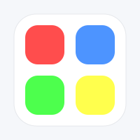
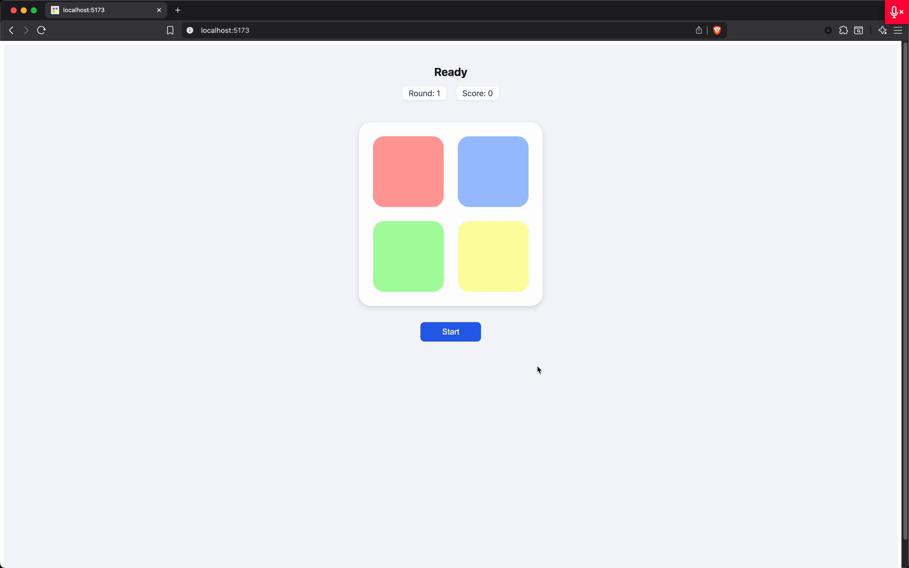

# 🎮 FollowTheFlow

_A modern, colorful memory game where the pattern grows — can you keep up?_ ⚡🧠

<p align="center">
  
</p>

<p align="center">
  <a href="https://github.com/NickTheDevOpsGuy/FollowTheFlow/actions/workflows/vercel-production.yml">
    
  </a>
  
  
  
</p>

<p align="center">
  
  
  
  
  
  
</p>

---

## 🖼 Preview

### Gameplay Demo



---

## 🌐 Live Demo

Try FollowTheFlow here: **https://follow-the-flow.vercel.app/**  
All logic runs in your browser — no backend required.

---

## 🚀 Features

- 🎨 **Modern Visual Design** – clean 2×2 pad grid with soft shadows and smooth animations.
- 🔁 **Dynamic Pattern Playback** – pads flash in sequence with configurable timing gaps.
- 🎯 **Player Turn Logic** – validates each click against the expected pattern step-by-step.
- ⚠️ **Game Over State** – wrong click ends the round with clear visual + status feedback.
- 📈 **Progressive Difficulty** – each successful round increases the sequence length.
- ⭐ **Score System** – earn points equal to the number of steps per completed round.
- 🔁 **Start / Continue / Restart Button** – label changes based on game state (new run, next round, or retry).
- ✨ **Click Feedback** – pads flash on player input for a satisfying, responsive feel.
- 🧠 **Clear HUD** – top bar shows current status, round, and score.

---

## 🗓️ Roadmap

### 🎵 Audio & Feedback

- Beep sounds per pad on playback and player clicks.
- Subtle “round complete” and “game over” audio cues.
- Optional mute toggle in the UI.

### 🎨 Visual Polish

- Pulse glow animation on active pads.
- Retro “Simon” theme preset.
- Dark mode toggle.
- Add lightweight particles or halo effect on correct sequences.

### 🧠 Gameplay Depth

- Endless mode with difficulty ramps.
- Time-based bonus scoring.
- Streak tracking (best round, best score).

### 🌐 Extras

- Local persistence of best score.
- Shareable “You reached Round X!” cards.
- Accessibility improvements (high-contrast palette / color-blind mode).

---

## 🛠 Tech Stack

| Name                                                  | Description                                          |
| :---------------------------------------------------- | :--------------------------------------------------- |
| [React](https://react.dev/)                           | UI library for building interactive components.      |
| [Vite](https://vitejs.dev/)                           | Fast dev server and bundler for modern web projects. |
| [TypeScript](https://www.typescriptlang.org/)         | Typed JavaScript for safer, more robust code.        |
| CSS Modules / plain CSS                               | Styling for pads, layout, HUD, and button states.    |
| [GitHub Actions](https://github.com/features/actions) | CI / CD with Vercel deployment workflow.             |

---

## 📦 Getting Started

1. **Clone the repository**

   ```bash
   git clone https://github.com/NickTheDevOpsGuy/FollowTheFlow.git
   cd FollowTheFlow
   ```

2. **Install dependencies**

   ```bash
   npm install
   # or
   pnpm install
   ```

3. **Run the development server**

   ```bash
   npm run dev
   # or
   pnpm dev
   ```

4. **Open the app**

   Vite will print a local URL (usually `http://localhost:5173`) — open it in your browser to play.

---

## 📂 Project Structure

> This is a simplified view focused on the game-related pieces.

```plaintext
.
├── eslint.config.ts
├── .github
│   ├── ISSUE_TEMPLATE
│   │   ├── bug.yml
│   │   ├── config.yml
│   │   ├── documentation.yml
│   │   ├── enhancement_refactor.yml
│   │   ├── feature_request.yml
│   │   └── question_discussion.yml
│   ├── pull_request_template.md
│   └── workflows
│       ├── FollowTheFlow.yml
│       └── vercel-production.yml
├── .husky
│   ├── pre-commit
│   └── pre-push
├── index.html
├── LICENSE
├── package.json
├── package-lock.json
├── .prettierignore
├── .prettierrc
├── .prettierrc.json
├── .prettierrc.yml
├── public
│   └── assets
│       ├── followtheflow.svg
│       └── preview.gif
├── README.md
├── scripts
│   └── precheck.sh
├── src
│   └── app
│       ├── App.css
│       ├── App.tsx
│       ├── components
│       │   ├── Controls
│       │   │   └── Controls.tsx
│       │   └── Pad
│       │       ├── Pad.css
│       │       └── Pad.tsx
│       ├── hooks
│       │   ├── useFlowGame.ts
│       │   └── useSequencePlayer.ts
│       ├── main.tsx
│       ├── types
│       │   └── types.ts
│       └── utils
│           └── sequence.ts
├── .stylelintrc.json
├── tsconfig.app.json
├── tsconfig.json
├── tsconfig.node.json
├── vite.config.ts
└── vite-env.d.ts
```

---

## 🤝 Contributing

Contributions, ideas, and experiments are very welcome:

- 🐛 **Found a bug?**  
  Open an issue with steps to reproduce.

- 💡 **Have an idea?**  
  Propose new patterns, visuals, or modes in Issues.

- 🔧 **Want to code a feature?**
  - Fork the repo
  - Create a branch (`feature/add-sound-effects`)
  - Open a PR with a clear description & screenshots/GIFs if relevant

If you’re unsure where to start, good first issues might be:

- Add pad sounds
- Improve accessibility for color-blind players
- Add a new visual theme

---

## 🦝 Built by NickDoesDevOps

Created with ☕, curiosity, and just enough chaos by  
[**Nicholas Clark**](https://www.linkedin.com/in/nicholas-a-clark/).

🏷 **#NickDoesDevOps** • **#LearningInPublic** • **#BuiltInPublic**
